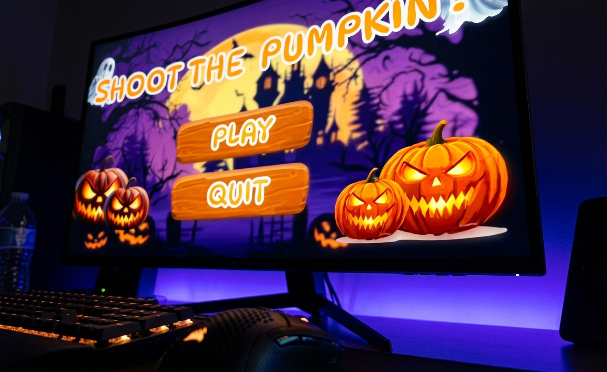
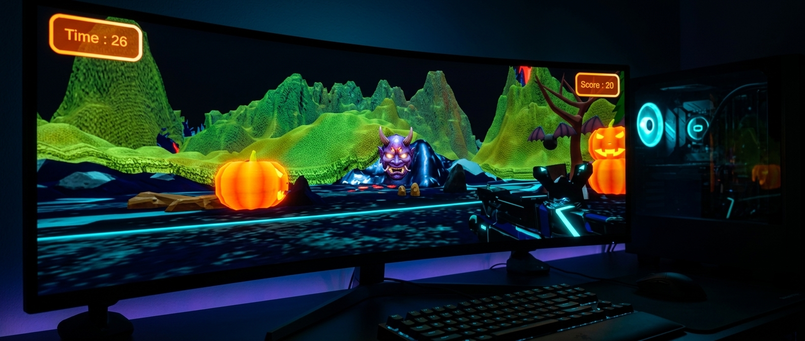
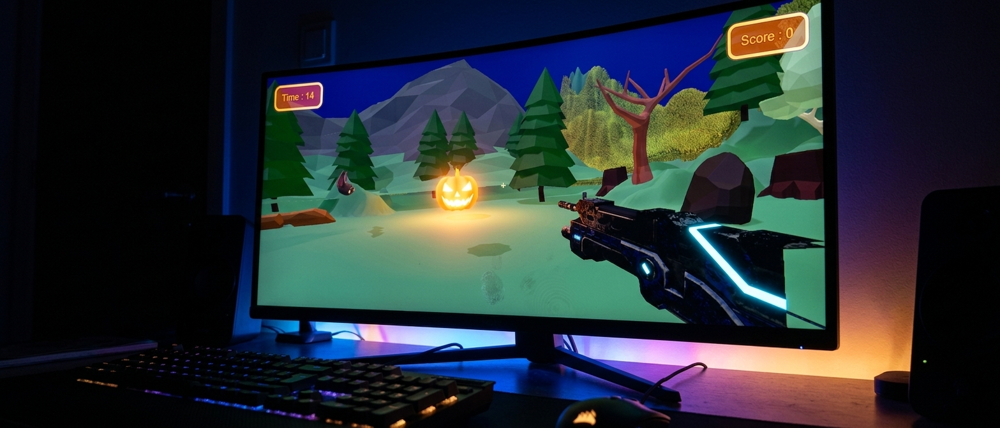
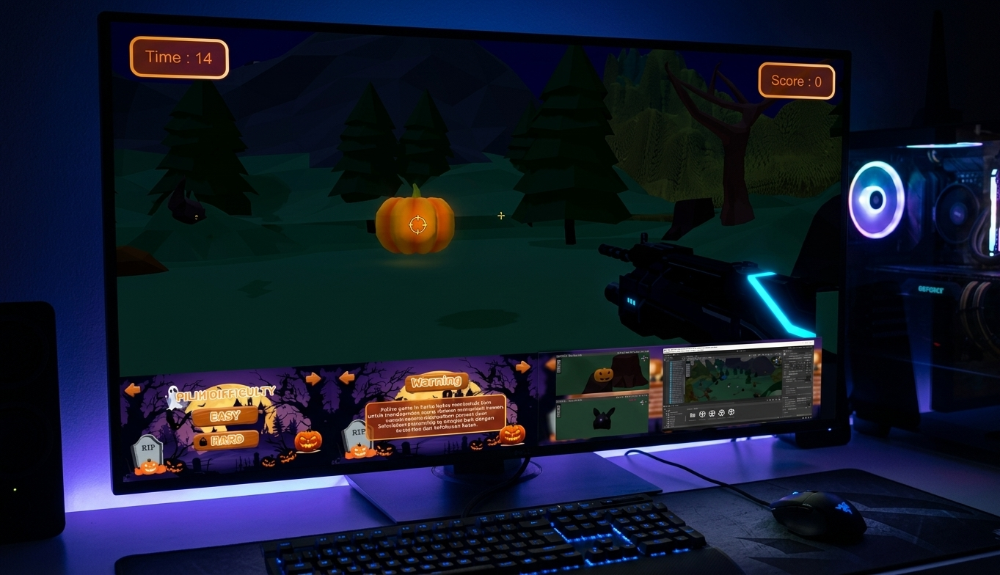

# 🎃 Halloween - FPS Shooting Game

> **Client Project:** This project was specifically developed according to client requirements to support psychological research in evaluating cognitive focus, reaction time, and visual attention.

**FPS • Shooting • Unity • Windows**

**Halloween** is a first-person shooter (FPS) game where players navigate a 360° environment and shoot randomly spawning pumpkins within a limited time. Players must maintain their focus and reaction speed while avoiding non-target objects such as black rabbits and bats, which reduce the player's score when shot.

---

## 🎨 Game Gallery & Screenshots

| Gameplay Preview 1 | Gameplay Preview 2 |
| :---: | :---: |
|  |  |

| Gameplay Preview 3 | Gameplay Preview 4 |
| :---: | :---: |
|  |  |

---

## 🎮 Game Overview

Players enter a dynamic FPS environment where pumpkins randomly appear throughout the map.

The primary objective is simple: **shoot as many pumpkins as possible before the timer runs out**.

However, players must stay alert. Shooting non-target objects such as black rabbits and bats results in score penalties, making visual attention and quick decision-making essential for achieving a high score.

---

## ✨ Key Features

- 🎯 **Dual Difficulty Modes:** Choose between *Easy* and *Hard* difficulty modes, each featuring different map layouts and progressively challenging gameplay conditions.
- 🔄 **360° FPS Camera:** An immersive first-person camera allows players to look around the environment freely and track targets from every direction.
- 🏆 **Precision Scoring System:** Real-time score calculation combined with a fixed time limit and target-based scoring penalties.
  - 🎃 Shoot pumpkins to increase your score
  - 🐇 Avoid black rabbits
  - 🦇 Avoid bats
  - ⏱️ Complete as many successful shots as possible before time runs out
- 🧠 **Research-Oriented Gameplay:** Specifically designed to measure and evaluate aspects of cognitive psychological research.

---

## 🕹️ Controls

| Action | Control |
|---|---|
| Look Around | Mouse |
| Shoot | Left Mouse Button |

---

## 🎯 Project Goals

Created for **educational and cognitive psychology research** to explore and evaluate:

- Cognitive focus
- Reaction time
- Visual attention
- Target identification
- Decision-making under time pressure

---

## 🛠️ Technology Stack

| Technology | Usage |
|---|---|
| Unity | Game Engine |
| C# | Game Development |
| Windows | Target Platform |
| First-Person Shooter | Core Game Mechanics |

---

## 📂 Repository Structure (`halloween-game`)

```text
halloween-game/
├── public/
│   └── docs/
│       ├── gameplay_1.jpg
│       ├── gameplay_2.jpg
│       ├── gameplay_3.jpg
│       └── gameplay_4.jpg
└── README.md

```
---

## 📥 Game Download (Standalone Build)

This game is distributed as a Windows Standalone Build via GitHub Releases.

You can try this game with click version release, download the .zip folder, extract the folder and run the main .exe files

Enjoy the game

Instructions: Download the ZIP file, extract the folder to your computer, and run the .exe executable to play the game.

---